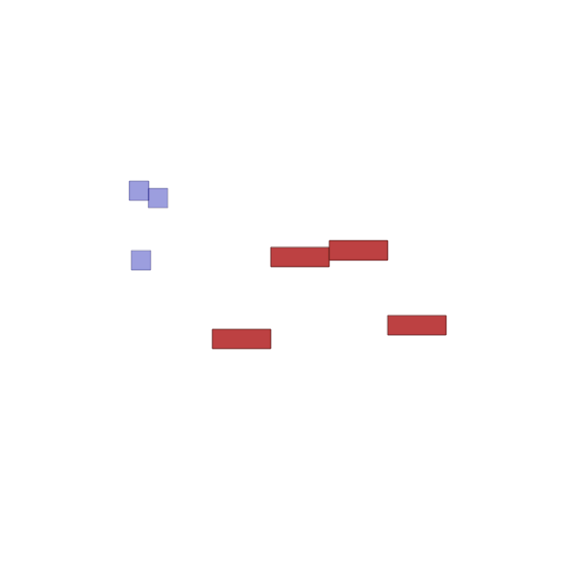

# marlone
Training a virtual 2D drone swarm to search for target(s) while optimizing for battery usage, time taken, area covered etc while also avoiding collisions with other drones and obstacles by communicating with each other.

## PEAS Description
> [!NOTE]  
> These are subject to change as I achieve further understanding of the nitty gritty details of the project.
### Performance Measures
- Battery Usage
- Area Covered
- Time Taken

It might be the case that some of these performance measures are redundant.
### Environment
- Other drones
- Obstacles of various shapes
- Wind (Probably a time-varying 2D vector field)

The environment is continuous, dynamic and stochastic.

### Actuators
- Ability to add and subtract from the force vectors the drone is generating. Or more simply, the ability to add and subtract from the drone's position and velocity vectors.
- Ability to send messages to other drones.

### Sensors
- LIDAR
- Ability to receive messages from other drones.

> [!NOTE]  
> Inter-agent communication is support natively by [VMAS](https://github.com/proroklab/vectorizedmultiagentsimulator) so we won't have to deal with personally handling the sending and receiving messages between drones.

## Possible Future Extensions
1. Uncertainty in observations made by drones.
2. Moving obstacles.
3. Communication hindrance caused by obstacles between drones.

## Notebooks
-  **Basic Custom Scenario in VMAS**. Here is a notebook which implements a custom scenario using [VMAS's](https://github.com/proroklab/vectorizedmultiagentsimulator) `BaseScenario` class. It includes multiple agents (in blue) and obstacles (in red). There is also a 2D vector field which is supposed to represent wind. The actions the agents take are random for now.

  
## What is Multi-Agent Reinforcement Learning
From [Wikipedia: Multi-Agent reinforcement learning](https://en.wikipedia.org/wiki/Multi-agent_reinforcement_learning):
> Study of behavior of multiple learning agents that coexist in a shared environment.
Each agent is motivated by its own rewards, and does actions to advance its own interests; 
in some environments these interests are opposed to the interests of other agents
Can be modeled by a Markov Decision Process

# Resources
Please see the [Github Wiki Page](https://github.com/kazurem/marlone/wiki/Resources)
